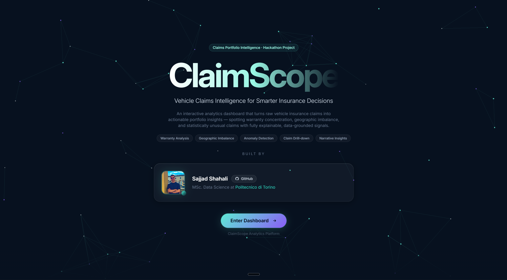
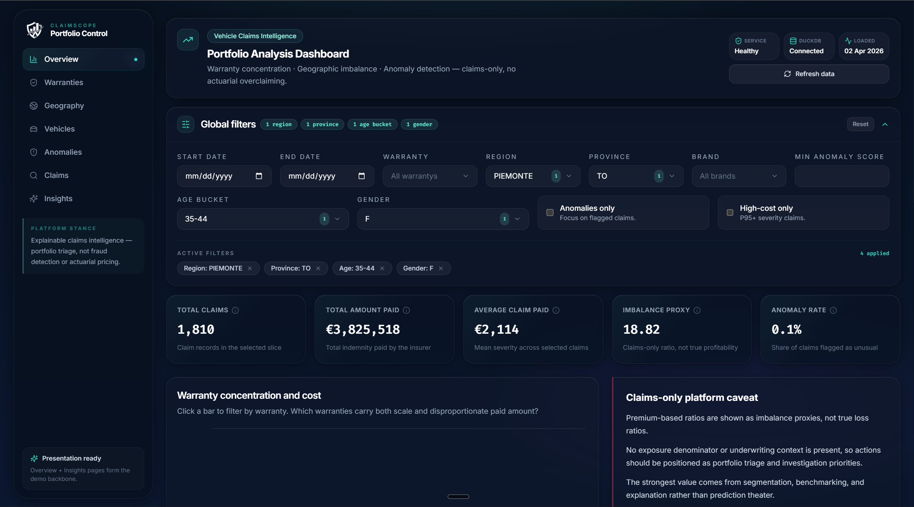

# ClaimScope — Vehicle Claims Portfolio Intelligence

<p align="center">
  
</p>

<p align="center">
  
</p>

[](LICENSE)
[](https://www.python.org/)
[](https://fastapi.tiangolo.com/)
[](https://duckdb.org/)
[](https://pola.rs/)
[](https://scikit-learn.org/)
[](https://docs.pydantic.dev/)
[](https://react.dev/)
[](https://www.typescriptlang.org/)
[](https://reactrouter.com/)
[](https://tanstack.com/query)
[](https://vitejs.dev/)
[](https://tailwindcss.com/)
[](https://threejs.org/)
[](https://recharts.org/)

> ClaimScope is a vehicle insurance claims portfolio intelligence platform that identifies warranty concentration, geographic imbalance, and anomalous claims using explainable analytics. Built on DuckDB and IsolationForest, it turns raw claims data into actionable triage signals — no actuarial black boxes, no LLM fabrication.

**GitHub:** https://github.com/Sajjad-Shahali/ClaimScope_hackathon

---

## What it does

ClaimScope answers four questions that claims analysts ask but rarely have fast answers to:

1. **Which warranty segments concentrate paid loss?** — Bar charts, ranking tables, and trend lines across all warranties in the portfolio.
2. **Which regions over-index on claim severity?** — Regional and province-level imbalance maps and drill-downs.
3. **Which brand/model combinations are structurally different from peers?** — Vehicle segment concentration with peer-group benchmarking.
4. **Which individual claims are statistically unusual?** — IsolationForest + peer-group z-score anomaly detection with human-readable reason strings.

It is intentionally **not** a fraud detection engine, **not** actuarial pricing, and **not** underwriting optimization. It is a decision-support analytics layer for portfolio triage.

---

## Tech stack

### Backend
| Layer | Technology |
|-------|-----------|
| API | FastAPI + Uvicorn |
| Analytics | DuckDB (file-based OLAP) |
| Pipeline | Polars (ETL) + Pandas (Excel ingestion) |
| Storage | Apache Parquet + PyArrow |
| Anomaly | Scikit-learn IsolationForest |
| Severity model | LightGBM (optional) |
| Validation | Pydantic v2 + pydantic-settings |
| Testing | Pytest with synthetic fixture data |
| Runtime | Python 3.12 |

### Frontend
| Layer | Technology |
|-------|-----------|
| Framework | React 18 + TypeScript + Vite |
| Routing | React Router v7 |
| Data fetching | TanStack React Query |
| Charts | Recharts |
| Styling | Tailwind CSS v3 + custom design tokens |
| 3D intro | Three.js network constellation |
| Icons | Lucide React |
| Fonts | Inter Variable + Fira Code |

---

## Project structure

```
ClaimScope_hackathon/
├── README.md
├── pyproject.toml
├── .env.example
│
├── data/
│   ├── raw/               ← place claim.xlsx here
│   ├── processed/         ← parquet outputs from pipeline
│   ├── marts/             ← analytic mart parquets
│   └── duckdb/            ← claimscope.duckdb serving store
│
├── pipeline/
│   ├── ingest.py          ← Excel → parquet
│   ├── validate.py        ← data quality report
│   ├── clean.py           ← flagging + normalization
│   ├── features.py        ← feature engineering
│   ├── anomaly.py         ← anomaly scoring
│   ├── marts.py           ← mart builder + DuckDB loader
│   ├── train_severity_model.py
│   └── run_pipeline.py    ← single entry point
│
├── backend/
│   └── app/
│       ├── api/routes/    ← HTTP handlers
│       ├── services/      ← orchestration + formatting
│       ├── repositories/  ← DuckDB SQL access
│       ├── schemas/       ← Pydantic response contracts
│       ├── db/            ← lazy database connection
│       └── core/          ← config + logging
│
└── frontend/
    ├── src/
    │   ├── pages/         ← Overview, Warranties, Geography, Vehicles, Anomalies, Claims, Insights, Intro
    │   ├── ui/
    │   │   ├── components/ ← KpiCard, ChartCard, DataTable, InsightList, MetricPills, FilterDock …
    │   │   └── layout/    ← AppLayout, Sidebar, TopBar
    │   ├── hooks/         ← useApiQuery, useDashboardFilters
    │   ├── lib/           ← api client, utils, formatters
    │   └── types/         ← API response types, filter types
    ├── tailwind.config.js
    └── vite.config.ts


```

---

## Quick start

### 1. Create and activate a Python virtual environment

```bash
python -m venv .env
# Windows
.env\Scripts\activate
# macOS / Linux
source .env/bin/activate
```

### 2. Install Python dependencies

```bash
pip install -U pip
pip install -e ".[dev]"

# Optional: LightGBM severity model
pip install -e ".[dev,model]"
```

### 3. Configure environment

```bash
cp .env.example .env
```

### 4. Add raw data

Place the source Excel file at:

```
data/raw/claim.xlsx
```

Expected sheet name: `Claim`

### 5. Run the pipeline

```bash
python -m pipeline.run_pipeline
```

This produces all processed parquets and loads `data/duckdb/claimscope.duckdb`.

### 6. Start the backend API

```bash
uvicorn backend.app.main:app --reload
```

API available at: `http://127.0.0.1:8000`  
Docs at: `http://127.0.0.1:8000/docs`

### 7. Start the frontend

```bash
cd frontend
npm install
npm run dev
```

Dashboard at: `http://localhost:5173`

---

## API endpoints

| Method | Path | Description |
|--------|------|-------------|
| GET | `/health` | Service health + DuckDB status |
| GET | `/filters` | Available filter options |
| GET | `/kpis` | Portfolio KPI summary |
| GET | `/warranties/overview` | Warranty ranking + metrics |
| GET | `/warranties/trend` | Claim trend by warranty |
| GET | `/warranties/{name}` | Single warranty drill-down |
| GET | `/geography/overview` | Regional imbalance summary |
| GET | `/geography/trend` | Geographic trend |
| GET | `/geography/region/{name}` | Region drill-down |
| GET | `/geography/province/{name}` | Province drill-down |
| GET | `/vehicles/overview` | Brand/model concentration |
| GET | `/vehicles/brands/{name}` | Brand drill-down |
| GET | `/vehicles/models/search` | Model search |
| GET | `/claims` | Paginated claim list |
| GET | `/claims/{claim_id}` | Single claim detail + anomaly components |
| GET | `/anomalies` | Anomaly-flagged claims |
| GET | `/anomalies/summary` | Anomaly reason bucket summary |
| GET | `/insights/summary` | Deterministic narrative insights |

All endpoints accept filter query parameters: `warranty`, `region`, `province`, `brand`, `start_date`, `end_date`, `anomaly_only`, `high_cost_only`, `min_anomaly_score`.

---

## Dashboard pages

| Page | Path | What it shows |
|------|------|---------------|
| Intro | `/` | Three.js network constellation landing, author card, project entry |
| Overview | `/app` | KPIs, warranty chart, regional chart, trend, anomaly buckets |
| Warranties | `/app/warranties` | Full warranty ranking and drill-down |
| Geography | `/app/geography` | Regional and province imbalance |
| Vehicles | `/app/vehicles` | Brand and model concentration |
| Anomalies | `/app/anomalies` | Anomaly list with score histogram |
| Claims | `/app/claims` | Full claim table with detail modal |
| Insights | `/app/insights` | Deterministic narrative text for presentations |

Global filter panel on every page: searchable multi-select dropdowns for warranty, region, province, brand, age bucket, gender + date range and toggles. Auto-expands on Overview, auto-collapses on all other tabs.

Every metric box and insight panel includes an info icon (ⓘ) with a hover tooltip explaining the metric's meaning and analytical context.

---

## Run tests

```bash
pytest
```

Tests use synthetic fixture data — no real claim data is required.

---

## Domain caveats

- This is a **claims-only** dataset. No policy exposure denominator is available.
- `PREMIUM_AMOUNT_PAID` is an **imbalance proxy input**, not an actuarial loss ratio denominator.
- Anomaly flags indicate statistical unusualness relative to peer groups — not fraud, waste, or abuse truth.
- All insights are deterministically generated from computed metrics, not LLM-inferred.
- Severity model outputs (when LightGBM is installed) are benchmarks for triage, not pricing decisions.
